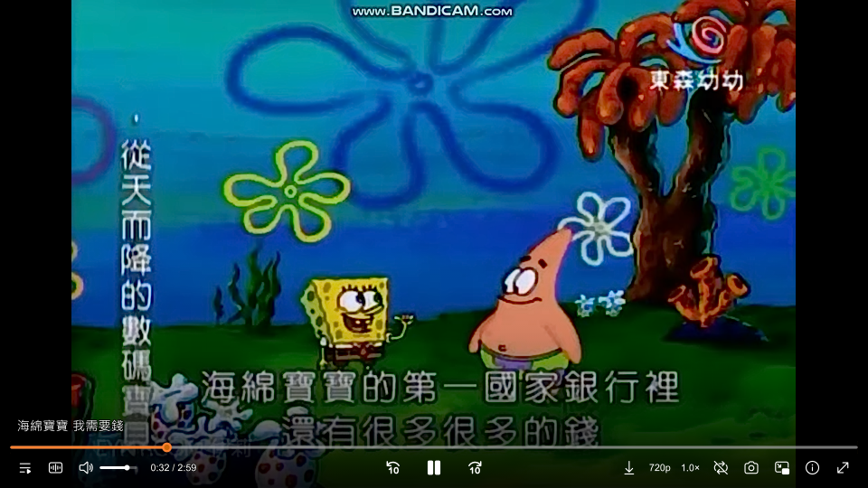

【前言】
程式基礎0的文科肥宅想用看看別人推薦的MPV播放器，所以用AI vibe coding改造，把介面改成比較喜歡的ModernZ的樣式，再微調一些我自己比較順手的使用方式
主要就是做出來自己用，所以我不會維護、不會更新，如果想要微調成自己習慣的使用操作方式，就自行拿去問AI吧!

# MPV-MZLazy

基於 [mpv-lazy (hooke007)](https://github.com/hooke007/mpv-lazy) 改造的 mpv 播放器設定包，
採用 [ModernZ](https://github.com/Samillion/ModernZ) 作為螢幕控制列（OSC）。





## 功能特色

- **yt-dlp 下載系統**：右鍵選單或工具列一鍵下載，支援 MP4/MKV 容器切換
- **音量／速度 OSC 閃爍**：按 `-` `+` `[` `]` 時工具列按鈕閃爍橘色並顯示當前數值
- **音量按鈕音軌選單**：工具列音軌按鈕左鍵開啟 `input.select` 選單，可新增外部音軌
- **自訂 OSC 工具列**：modernz 四種佈局，含下載、音量、速度等專用按鈕
- **著色器管理**：F8 選單、Ctrl+1~0 快速切換、Ctrl+\` 清空
- **VF 濾鏡管理**：F10 選單、~!@#$%^& 快速切換補幀與 AI 增強
- **截圖系統**：三種模式（原始／含 OSD／視窗），自訂檔名格式
- **字幕樣式設定**：F11 即時調整字型、大小、邊框
- **VCS 章節牆**：F9 圖形化預覽章節縮圖
- **單一實例**：重複開啟 mpv 時自動傳送檔案至首個實例

## 安裝方式

1. 下載 [mpv-lazy 原始包](https://github.com/hooke007/mpv_PlayKit/releases)（內含 mpv.exe、Python、VapourSynth 等執行環境）
2. 下載 MPV-MZLazy 的 `portable_config` 資料夾
3. 將 MPV-MZLazy 的 `portable_config` **完整覆蓋**到 mpv-lazy 根目錄下的同名資料夾
4. 執行 `mpv.exe` 即可使用

> 下載功能需要 [yt-dlp](https://github.com/yt-dlp/yt-dlp) 安裝於 PATH。
> 補幀功能需要對應的 VapourSynth 模型檔案（RTX 版需額外安裝 DLC-vsNV）。

## 快捷鍵一覽

### 音量控制

| 按鍵 | 功能 |
|------|------|
| `-` | 音量 -1 |
| `+` | 音量 +1 |

### 播放速度

| 按鍵 | 功能 |
|------|------|
| `[` | 減速 0.1 |
| `]` | 加速 0.1 |
| `Ctrl+[` | 速度循環遞減（2→1.5→1.2→1） |
| `Ctrl+]` | 速度循環遞增（1→1.2→1.5→2） |

### 著色器（F8）

| 按鍵 | 功能 |
|------|------|
| `Ctrl+\`` | 清空著色器 |
| `Ctrl+1`~`Ctrl+0` | 快速切換各類著色器 |
| `F8` | 開啟著色器選單 |

### VF 濾鏡（F10）

| 按鍵 | 功能 |
|------|------|
| `~` | 清空 VF 濾鏡 |
| `!` | 補幀 MVTools 快速 |
| `@` | 補幀 RIFE DX12 |
| `#` | 補幀 DRBA DX12 |
| `$` | 補幀 RIFE RTX |
| `%` | 補幀 DRBA RTX |
| `^` | AI UAI DX12 |
| `&` | AI UAI RTX |
| `F10` | 開啟 VF 濾鏡選單 |

### yt-dlp 下載（F5 或工具列按鈕）

| 操作 | 功能 |
|------|------|
| 右鍵 → 下載 → 選擇畫質 | 選取畫質下載 |
| 工具列下載按鈕左鍵 | 依設定直接下載 |
| 工具列下載按鈕右鍵 | 開啟下載資料夾 |
| 右鍵 → 下載 → 輸出格式 | 切換 MP4 / MKV |

### 螢幕截圖

| 按鍵 | 模式 |
|------|------|
| `Ctrl+s` | 含字幕 OSD |
| `F12` | 視窗模式 |

**檔名格式**：`{影片名稱}-{時間位置HHMMSS}-{日期時間YYYYMMDDHHMMSS}.png`

### 播放控制

| 按鍵 | 功能 |
|------|------|
| `Space` | 暫停／播放 |
| `Left` / `Right` | 倒退／前進 5 秒 |
| `,` / `.` | 上一幀／下一幀 |
| `l` | AB 循環 |
| `BS` | 重置影片縮放／裁切 |

### 功能選單

| 按鍵 | 功能 |
|------|------|
| `F8` | 著色器選單 |
| `F9` | VCS 章節牆 |
| `F10` | VF 濾鏡選單 |
| `F11` | 字幕樣式設定 |
| `Shift+F9` | 速度選單 |
| `Ctrl+o` | 開啟檔案 |
| `` ` `` | 控制台 |
| `I` | 統計資訊 |

## yt-dlp 下載系統

### 使用方式

- **右鍵選單**：右鍵 → 下載 → 選擇畫質（最佳／1080p／720p／音訊）
- **工具列按鈕**：左鍵直接下載（格式依設定），右鍵開啟下載資料夾

### 容器格式切換

右鍵 → 下載 → 輸出格式 → 選擇 MP4 或 MKV，選擇後立即生效。

### 設定檔

`ytdl_download.conf`（右鍵 → 下載設定 編輯）：

```ini
download_path=~~desktop/
preset=1080p
output_format=mp4
```

## OSC 工具列按鈕

| 按鈕 | 左鍵 | 右鍵 |
|------|------|------|
| 上一首 | 上一首 | 播放清單選擇 |
| 倒退 | 倒退 10 秒 | 倒退 60 秒 |
| 前進 | 前進 10 秒 | 前進 60 秒 |
| 下一首 | 下一首 | 播放清單選擇 |
| 播放／暫停 | 切換 | 循環模式 |
| 音軌 | 音軌選擇（input.select） | 循環音軌 |
| 字幕 | 字幕選擇 | 循環字幕 |
| 音量 | 靜音切換 | 音訊裝置 |
| 播放清單 | 播放清單 | 總選單 |
| 截圖 | 截圖（原始） | 截圖設定 |
| 下載 | yt-dlp 下載 | 開啟下載資料夾 |
| 全螢幕 | 切換 | 最大化 |
| 速度 | 加速 0.1 | 重置 1x |
| 視窗頂置 | 切換 | — |

## 設定檔結構

```
portable_config/
├── mpv.conf                  # 主設定
├── input_uosc.conf           # 按鍵綁定
├── menu.conf                 # 右鍵選單
├── profiles.conf             # 自動條件設定
├── modernz.conf              # OSC 設定
├── ytdl_download.conf        # yt-dlp 下載設定
├── script-opts/
│   ├── screenshot.conf       # 截圖格式設定
│   └── modernz-locale.json   # OSC 中文語系
├── scripts/
│   ├── modernz.lua           # 自訂 OSC（含下載按鈕、音量速度閃爍）
│   ├── ytdl_download.lua     # yt-dlp 下載腳本
│   ├── input_plus.lua        # 增強功能整合
│   ├── screenshot_namer.lua  # 截圖命名
│   ├── screenshot_menu.lua   # 截圖格式選單
│   ├── shader_menu.lua       # 著色器管理
│   ├── vf_menu.lua           # VF 濾鏡選單
│   ├── speed_menu.lua        # 速度選單
│   ├── subtitle_menu.lua     # 字幕樣式
│   ├── vcs_wall.lua          # 章節牆
│   ├── open-file.lua         # 開啟檔案
│   ├── pl_manager.lua        # 播放清單管理
│   ├── single_instance.lua   # 單一實例
│   ├── save_global_props.lua # 屬性記憶
│   ├── resume_pref.lua       # 接續播放偏好
│   ├── window_size.lua       # 視窗縮放記憶
│   ├── mpv-file-organizer.lua# 媒體歸檔
│   └── thumb_engine/         # 縮圖引擎
├── shaders/                  # 著色器（動畫修復／升頻／銳化）
├── vs/                       # VapourSynth 補幀腳本
└── fonts/                    # 工具列圖示字型
```

## 與原始 mpv-lazy 的差異

- OSC 由 uosc 更換為 ModernZ
- 新增 yt-dlp 下載系統（右鍵選單 + 工具列按鈕，支援 MP4/MKV 容器切換）
- 音量 `-` `+` 按鍵改為 modernz OSC 橘色閃爍回饋（關閉 mpv 內建 OSD）
- 速度 `[` `]` 按鍵改為 `no-osd` 前綴，OSC 按鈕閃爍顯示當前數值
- 工具列音軌按鈕左鍵改為 `input.select` 選單（可新增外部音軌）
- 新增 F5 下載快捷鍵綁定
- 工具列新增下載按鈕、下載資料夾按鈕
- input_plus.lua 新增設定檔編輯功能（`script-message edit`）

## 授權說明

MPV-MZLazy 新增與修改的部分採用 **GNU General Public License v2.0**。
各上游元件的個別授權請參閱同目錄的 `LICENSE.MD`。

- [mpv](https://github.com/mpv-player/mpv) — GPLv2
- [mpv-lazy](https://github.com/hooke007/mpv-lazy) — 混合授權
- [ModernZ](https://github.com/Samillion/ModernZ) — LGPLv2.1
- [yt-dlp](https://github.com/yt-dlp/yt-dlp) — Unlicense / GPLv3

---

> 本專案建構改造由 AI 輔助完成。
